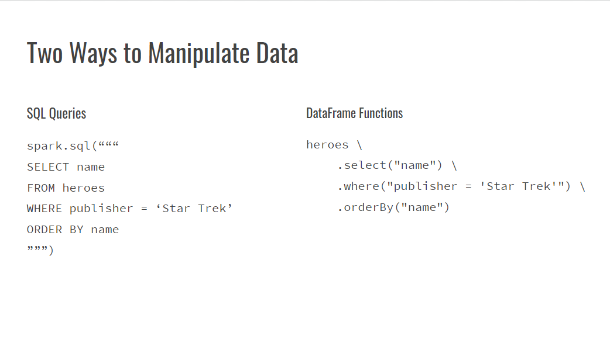
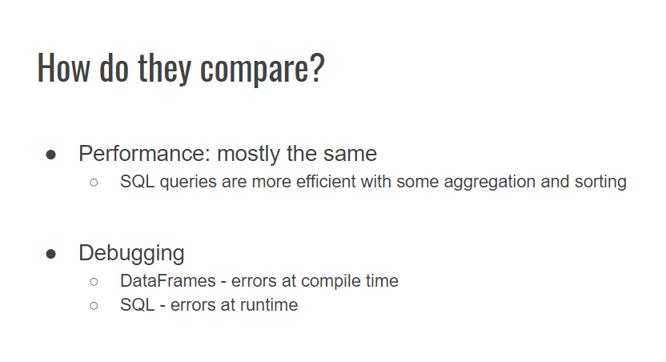
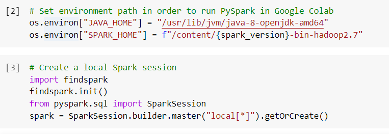

# Lesson Plan: Spark Up a Conversation - DataFrames and Spark SQL
## Overview

Today's class will introduce students to how to join two data structures in Spark. 

Before class, Slack out some of the following helpful links and encourage students to conduct research and review supplementary resources outside of class.

  * [Spark SQL API Guide](https://spark.apache.org/docs/2.4.7/sql-programming-guide.html)
  * [PySpark DataFrames API Documentation](https://spark.apache.org/docs/2.4.7/api/python/pyspark.sql.html)
  * [StackOverflow: Writing SQL vs using Dataframe APIs in Spark SQL](https://stackoverflow.com/questions/45430816/writing-sql-vs-using-dataframe-apis-in-spark-sql)
  * [Superhero Dataset from Kaggle](https://www.kaggle.com/claudiodavi/superhero-set)

## Learning Objectives
By the end of this class, students will be able to:

  * Explain how the Spark SQL module fits into the Spark platform
  * Compare using built-in DataFrame functions versus SQL to manipulate DataFrames
  * Write queries to join data structures with DataFrame functions and SQL
  * Debug queries written with DataFrame functions and SQL

## Instructor Prep

  
<strong>Instructor Notes</strong>

  * Provide the folders with today's activities to students before class. Instruct them to upload the entire Activities folder to the Google Drive folder that they've been using for class so far.
  * Upload the Activities folder to your Google Drive as well. Run through the activities so you are familiar with the code and can anticipate any issues the students may run into.
  * Before class, go to http://www-us.apache.org/dist/spark/ and look for the latest version of spark 2.0. Update the `spark_version` variable accordingly in the first block of code for each activity. If the version has changed, let the students know so they can update their code too.
  * Each notebook starts with the same three blocks of code that you need to run to set up Spark in that particular Google Colab notebook. The first block of code to install Spark and its dependencies can take up to a minute to run. So when you open each notebook, immediately run the first cell. As you wait for the code to run, provide a high-level overview of the activity and the concepts being practiced.

  
<strong>Class Slides and Time Tracker</strong>

The slides for this lesson can be viewed on Google Drive here: [Lesson Slides](https://docs.google.com/presentation/d/1Q-PVlZOfb67LuNnJWJ0eq8b5zTPO0ynpTNoYal6mYBI/edit?usp=sharing)

The time tracker for this lesson can be viewed here: [Time Tracker](https://docs.google.com/spreadsheets/d/1cRuHaY-ELLqW2cY9ltv_WCC4MzHwAd79Vx30Tn7nuVE/edit?usp=sharing)

- - -

## Class Activities

  
<strong>📣 1. Instructor Do: Welcome (0:10)</strong>

  Welcome students to class. Explain that today we will be discussing Spark SQL and how to join data structures in two different ways: using SQL and built-in DataFrame functions.
  
  To get students engaged, and also to help you understand your students' experience so you can tailor the rest of the class, ask the following questions.

  * Who has used SQL?
    * Ask what their main use cases are.
    * What SQL client do they use to run SQL queries?
    * Do they export the data and manipulate it somewhere else?
  * Who has used pandas before? For those who are not familiar, explain that pandas is a popular Python library used for data analysis.
    * Ask about the latest project they completed with pandas.
    * Ask if they prefer manipulating data in pandas DataFrames in Python or with SQL.
  
  Reassure students that they can use the skills they have built up with SQL or pandas DataFrames with Spark, but with Spark they can analyze much larger datasets!

- - -

  
<strong>📣 2. Instructor Do: Intro to Spark SQL (0:10)</strong>

  Open the lesson slides.
  * Spark SQL Architecture. Explain this diagram from the bottom up.
    * At the bottom we import our data, whether it's from file formats like JSON or CSV or from a number of supported databases.
    * Spark SQL is one of several modules available on the Spark platform. There are other modules like MLlib for machine learning, Spark streaming, and GraphX for graph computation, among others. In this class we are focusing on the Spark SQL module for data manipulation.
    * There are various language APIs that we can use to interact with Spark SQL. In this class we will use Python. There are also language libraries for Scala, R, and Java.
    * Once we have chosen a language, there are two ways of manipulating DataFrames: with SQL queries or built-in DataFrame functions.
    
  * Explain to students that these two blocks of code return the same results.
    * Ask students which block of code they prefer. Is one easier to read? Which way do you think is easier to learn?
    
  * How do they compare?
    * Let students know that in a majority of cases, the performance between a SQL query and DataFrame function is identical.
    * For debugging, ask students if they would prefer to find an error at compile time or at runtime and why.
      * **Sample Answer**: If you can identify an error earlier in the pipeline you can save time and iterate on your solution faster. This matters especially with large datasets. If you have an error with your query in SQL, the process could run for hours before it returns an error.
    

- - -

  
<strong>📣 3. Instructor Do: Compare DataFrames and SQL APIs (0:10)</strong>

  **Corresponding Activity:** [01-Ins_SQL_and_DataFrames](Activities/01-Ins_SQL_and_DataFrames/Solved)

  **File:** [dataframes_and_sql.ipynb](Activities/01-Ins_SQL_and_DataFrames/Solved/dataframes_and_sql.ipynb)

  * Make sure you looked up the latest version of Spark 2.0 and updated all of the notebooks for today's activities per the instructions in [Instructor Prep](#instructor-prep).
  * Run the first block of code. While it is running (it can take up to a minute), remind students that we need to include this code in every Google Colab notebook where we want to run Spark. Because Google Colaboratory allows you to execute code on Google's cloud servers, each time we open a new notebook we are essentially starting with a blank slate, so we need to install our dependencies.
    
  * Run the next two blocks of code and explain to students that we are setting up and running a Spark session.
    
  * Next we will import the data. Run this block of code. Click on the "Choose Files" button. Navigate to and select the `heroes_information.csv` file on your machine.
    
    * You can mention that the data was obtained from Kaggle using [this link](https://www.kaggle.com/claudiodavi/superhero-set).

  * Now that we have imported the data file, let's load the data into a Spark DataFrame.
    * Mention to students that Spark can also load in data from JSON, CSV, and text files, and more importantly, databases.
    * With the `inferSchema = "true"` option, we are directing Spark to analyze the data and infer what data type each column is. There is an option to provide our own schema instead of having Spark infer it, but we won't be covering that today.
    * We also let Spark know that the first row in our dataset is a header. It will use this header row to name the columns
    * Next we create a view from the newly-created DataFrame so that we can query it in SQL.
    
  * Now let's compare the performance of writing a query in SQL versus with the DataFrames API. Here we are writing a query to count the number of superheroes by hair color.
    
  * Next we write the same query with the DataFrames API.
    * Point out that we need to import `col` in order to use the `orderBy()` function.
    * Mention that this code can be written all on one line. Some people prefer to keep things in as few lines as possible, while others prefer line breaks for readability.
    * Show that this approach is a bit more forgiving with the ordering. For example, you can put the `limit()` clause before the `orderBy()` clause and you will get the same result. If you did the same ordering in SQL, you would get an error.
    * Point out that both methods return the same results.
      
  * Finally, let's look at the physical plan for each approach by using `explain()`. This is how Spark will execute each query. Point out that the physical plans are identical between the two approaches.
    * Students might be familiar with the similar `EXPLAIN` clause in SQL.
    * It's not important to dive into the details of the physical plan right now. Later on it will be helpful for tuning our Spark queries, but for now we want to notice that using the DataFrames or SQL API produces the exact same performance.
    
That's it! Now that we can see the two approaches have the same performance, you can use whichever method you and your team feel most comfortable with. Now let's get some practice with joins using both methods. First we'll focus on writing SQL queries.
  

- - -

  
<strong>✏️ 4. Student Do: Superheroes in SQL (0:15)</strong>

**Corresponding Activity:** [02-Stu_Superheroes_SQL](Activities/02-Stu_Superheroes_SQL/Unsolved)

In this activity, students will join across two different datasets with SQL queries.

**Instructions:** [README.md](Activities/02-Stu_Superheroes_SQL/README.md)

**File:** [superheroes_in_sql.ipynb](Activities/02-Stu_Superheroes_SQL/Unsolved/superheroes_in_sql.ipynb)

- - -

  
<strong>⭐ 5. Instructor Do: Review Superheroes in SQL (0:15)</strong>

**File:** [superheroes_in_sql.ipynb](Activities/02-Stu_Superheroes_SQL/Solved/superheroes_in_sql.ipynb)

  * For the file upload, select both CSV files from the Resources folder. Show students how to hold down SELECT on the keyboard while selecting both files in the Resources folder.
    
  * Point out that we need to make two separate variables when we import the data into DataFrames. We also need to call `.createOrReplaceTempView()` separately for each DataFrame.
    
  * Go over all of the SQL queries in the solutions files. Ask students if they used different techniques to get to the same answer. If they say yes, ask if they can share their screen to show the class their different approach!
  * For the first query we want to select three columns from the `heroes` table. Note that students may have named their tables differently.
    * Point out that we use backticks when selecting ``Eye color`` because there is a space in the column name. We could have also renamed this column to get rid of the space.
    * We are using an `INNER JOIN` for this query. Ask students if anyone used a different join. When considering joins we want to figure out if there are any records that exist in one table but not the other. As we will see later in this activity, this is indeed the case here - not all heroes exist in both tables. However, because the instructions say to filter for criteria in both tables, we can use an `INNER JOIN` here.
     
  * For the second query, point out that we are performing some aggregation here, as opposed to a simple select. If the datasets we were working with contained millions of rows, this is where Spark shines with its parallel processing capabilities!
    
  * For the third query, highlight the use of the `LEFT JOIN`. There are several ways to write a SQL query to find records in one table but not the other. Ask if students used any other approaches. Refer to https://explainextended.com/2009/09/15/not-in-vs-not-exists-vs-left-join-is-null-sql-server/ for methods other than the LEFT JOIN/IS NULL approach used here.
    

Let students know that in the next activity we will write the same joins as we did in this activity, but this time with built-in DataFrame functions instead of SQL.

- - -